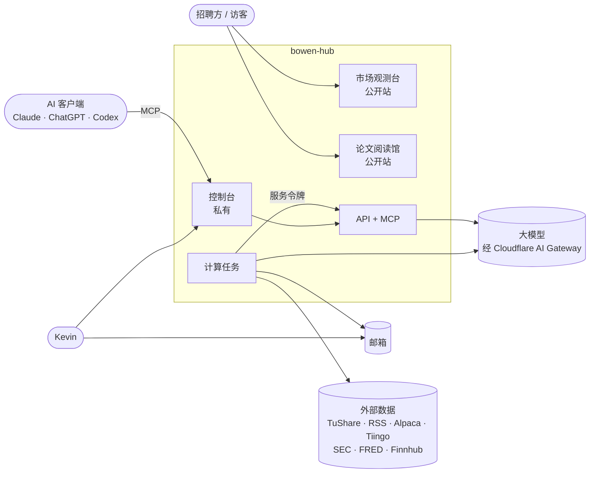
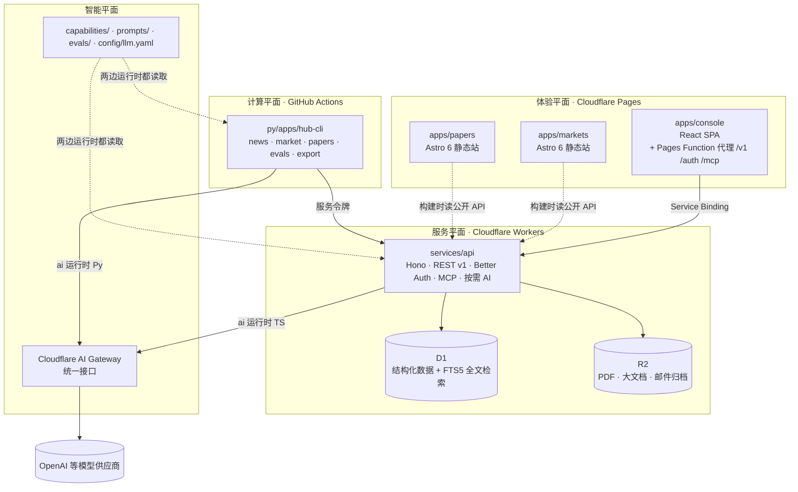
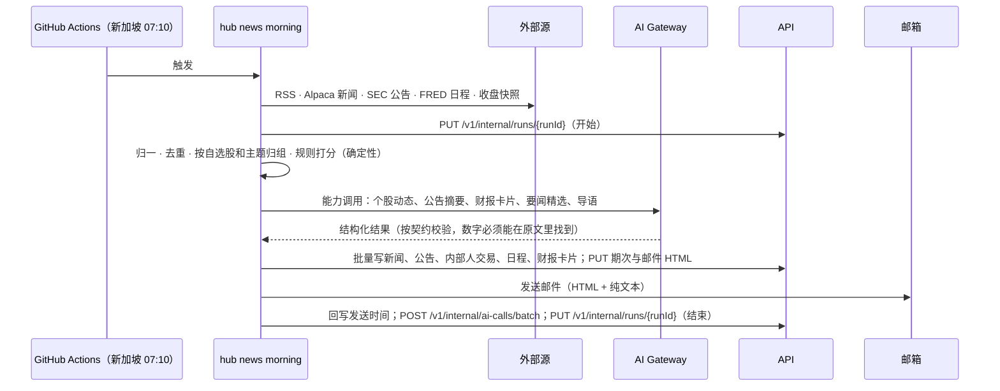

# 01 架构与技术栈

> 本文件是架构的总图和技术选型的唯一依据。细节分散在：契约 `08`、后端与数据 `09`、AI 能力层 `10`、Agent 协同 `11`、基础设施 `12`、前端 `05`。每个关键决定在 `docs/adr/` 里有一条决策记录。
> 这里写了的就照做；没写的，先按“最简单能工作”的方式做，并补一条 ADR。

## 1. 一句话架构

**契约驱动的多语言单仓：TypeScript 负责“对外服务”（网站、API、MCP），Python 负责“计算”（行情、新闻、论文、评测），两边只通过契约生成的类型交流；AI 能力是可配置、可评测、可换模型的插件。**

## 2. 设计目标

| 目标 | 具体含义 | 靠什么实现 |
|---|---|---|
| 清晰 | 任何人（或 Agent）打开仓库 10 分钟内知道“什么在哪、谁依赖谁” | 五个平面、固定目录、依赖规则由工具强制 |
| 可并行 | 10 个 Agent 同时开发互不踩脚 | 契约优先、预接线、路径所有权、模拟数据（见 `11`） |
| 随模型变强而变强 | 换更强的模型只改配置，效果由评测证明 | 能力清单 + 模型档位 + 自治等级 + 评测（见 `10`） |
| 前后端完全分离 | 前端只认 API 契约，不碰数据库和后端代码 | 生成的客户端；独立构建、独立部署 |
| 免费 | 除 AI 按量付费外不花钱 | Cloudflare 免费版 + GitHub Free（见第 9 节） |
| 快 | 公开页面首屏就是内容 | 公开站静态生成；重计算都在后台提前算好 |
| Agent 可操作 | Claude、ChatGPT 等可以直接用这套系统 | 内置 MCP 服务（见 `09`） |

## 3. 系统全景



## 4. 五个平面

| 平面 | 放什么 | 运行在哪 | 语言 |
|---|---|---|---|
| **体验平面** | 市场观测台（公开）、论文阅读馆（公开）、控制台（私有） | Cloudflare Pages | TypeScript（Astro 6 / React 19） |
| **服务平面** | 唯一的后端 API：REST v1、鉴权、MCP、按需 AI（论文问答） | Cloudflare Workers + D1 + R2 | TypeScript（Hono） |
| **计算平面** | 定时和按需的重活：美股新闻室、A 股收盘计算、论文入库、评测、数据导出 | GitHub Actions | Python |
| **智能平面** | AI 能力清单、提示词、模型档位、评测集；两种语言各有一个很薄的运行时 | 随调用方运行 | 与语言无关的 YAML/Markdown |
| **契约平面** | 所有接口和数据文档的唯一定义，生成两种语言的类型、校验和模拟 | 构建时 | TypeSpec |

硬规则：
- **写数据只有一条路：经过 API。** 计算任务用服务令牌调用 `/v1/internal/*` 写入；前端和计算任务都不直接碰数据库。
- **公开站是纯静态的。** 构建时从公开 API 读数据生成 HTML；浏览时不请求任何接口。
- **业务计算只在 Python 计算平面。** API 只做存取、组装、鉴权和按需 AI，不重算任何指标。

## 5. 容器图



控制台为什么要代理：控制台在 `bowen-console.pages.dev`，API 在 `*.workers.dev`，两个都在公共后缀域名下，跨站 Cookie 会被浏览器拦掉。让控制台的 Pages Function 通过 Service Binding 把 `/v1/*`、`/auth/*`、`/mcp`、`/.well-known/*` 原样转给 API Worker（不改写路径）：同源、第一方 Cookie、没有 CORS，通行密钥（passkey）也只绑定这一个域名。控制台自己的页面路径不以这四个前缀开头。

## 6. 四条关键链路

**美股早报**


**A 股收盘**：GitHub Actions 在北京时间 17:05–22:05 每小时触发 → `hub market eod` 拉 TuShare → Polars 计算 → 结算与生成假设、近五日演化 → 按固定顺序写入 API（假设 → 指数日线 → 交易日 → 周报 → 参考资料，`03` 第 2 节）→ 发出 `markets-updated` → `deploy-markets` 从公开 API 构建 Astro 站 → 发布到 `bowen-market-observatory`。

**论文入库**：控制台上传 PDF（或贴 arXiv 链接）→ API 存进 R2、记一条上传、用 `repository_dispatch` 触发 `papers-ingest` 工作流 → `hub papers ingest` 抽页文本、生成页图 → AI 能力 `papers.author` 读整篇原文写导读 → 确定性校验，不通过就带着错误清单让模型修改（最多 2 轮）→ `papers.review` 审核 → 写入草稿 → Kevin 在控制台读、提修改意见或点“公开” → API 发出 `papers-changed`，触发 `deploy-papers`。

**AI 客户端提问**：Claude 连接 `https://bowen-console.pages.dev/mcp` → OAuth 登录（通行密钥）→ 调用工具 `papers_ask` → API 读 D1 与 R2 → 运行能力 `papers.qa` → 收齐回答后整段返回。

## 7. 仓库布局

```text
bowen-hub/
├── AGENTS.md  CLAUDE.md  README.md  mise.toml  .env.example  .gitignore
├── docs/                 规格、ADR、进度记录
├── tasks/                任务图 graph.yaml（Agent 并行开发的工作分解）
├── contracts/            TypeSpec 契约（唯一事实源）+ generated/（OpenAPI、JSON Schema）
├── capabilities/         AI 能力清单（YAML）
├── prompts/              提示词（Markdown）
├── evals/                评测集与评分器
├── config/               业务配置（YAML）
├── fixtures/             对照数据、录制的外部 HTTP 响应
├── apps/                 前端（pnpm 工作区）
│   ├── markets/          Astro 6，公开
│   ├── papers/           Astro 6，公开
│   └── console/          React 19 SPA，私有
├── services/
│   └── api/              Hono on Cloudflare Workers
├── packages/             TypeScript 库
│   ├── contracts/        生成：类型、Zod、fetch 客户端、TanStack Query hooks、MSW 模拟
│   ├── ui/               设计系统：令牌、Astro 静态组件、React 交互组件、格式化函数
│   ├── ai/               TS 版 AI 运行时（AI SDK 6）
│   └── config/           tsconfig / Biome 共享配置
├── py/                   Python（uv 工作区）
│   ├── packages/
│   │   ├── hub-contracts/   生成：Pydantic 模型
│   │   ├── hub-core/        配置、HTTP、API 客户端、邮件、日志、交易日历、数据源协议
│   │   ├── hub-ai/          Python 版 AI 运行时（Pydantic AI）+ 评测
│   │   ├── hub-providers/   外部数据适配器：tushare · rss · alpaca · tiingo · sec · fred · finnhub
│   │   ├── hub-market/      A 股领域计算（纯函数，Polars）
│   │   ├── hub-newsroom/    新闻室领域逻辑
│   │   └── hub-papers/      论文领域逻辑（PDF、草稿校验、迁移）
│   └── apps/hub-cli/        所有任务的入口（typer）
├── infra/                wrangler 配置、Cloudflare/GitHub 初始化脚本
├── tools/                代码生成、架构检查、脚手架
└── .github/workflows/    CI、定时任务、部署
```

**依赖规则**（CI 里用 dependency-cruiser 和 import-linter 强制，违反就失败）：

| 谁 | 只能依赖 |
|---|---|
| `apps/*` | `packages/contracts`、`packages/ui` |
| `services/api` | `packages/contracts`、`packages/ai` |
| `packages/ui` | `packages/contracts`（只引用类型） |
| `py/apps/hub-cli` | `py/packages/*`（只负责加载各包注册的子命令） |
| `hub-core` | `hub-contracts`（含数据源协议、交易日历协议、API 客户端、邮件、设置） |
| `hub-ai` | `hub-contracts`、`hub-core` |
| `hub-providers` | `hub-contracts`、`hub-core`（实现 `hub-core` 里的数据源协议） |
| 领域包的**纯逻辑模块**（`hub_market` 的 `compute` `summary` `hypotheses` `evolution` `weekly` `common`；`hub_newsroom` 的 `pipeline` `ai` `common`；`hub_papers` 的 `check` `derive` `excerpt` `ids` `ai` `common`） | `hub-contracts`、`hub-ai`、`hub_core.protocols`（协议固定放在此处，不得引用 `hub_core` 的其他模块）；**不许**引用 `hub-providers`、`httpx`、`smtplib`，不做网络和文件 IO |
| 领域包的**编排模块**（`eod`（`backfill` 命令也在这里）`compare` `editions` `render` `ingest` `revise` `localtask` `pdf` `migrate` 和各 `commands.py`） | `hub-contracts`、`hub-ai`、`hub-core` 的全部模块、`hub-providers`；网络和文件 IO 只出现在这里 |
| 任何代码 | 不许手改生成目录（`packages/contracts/src/generated`、`py/packages/hub-contracts`、`contracts/generated`） |

## 8. 技术栈（固定）

版本以 lockfile 为准：开工时取当前稳定版并锁定，升级走 PR 和 CI。

下面列的是主要选型。工具类小库（YAML 解析用 PyYAML / `yaml`、HTTP 录制回放用 pytest-recording、日期处理、Markdown 渲染用 Astro 自带的 remark/rehype 等）不需要 ADR，在 PR 里说明即可；新增服务或替换主要选型才需要 ADR。

**工具链**

| 用途 | 选型 |
|---|---|
| 工具版本与统一命令 | mise（锁定 Node、pnpm、Python、uv 版本；`mise run <任务>` 是所有人和 Agent 的唯一入口） |
| TS 工作区 / 任务编排 | pnpm workspace + Turborepo |
| Python 工作区 | uv workspace |
| TS 检查 | Biome 2（lint + format）、`tsc --strict`、Vitest |
| Python 检查 | ruff、pyright（strict）、pytest |
| 架构检查 | dependency-cruiser（TS）、import-linter（Python） |
| 端到端与视觉 | Playwright、Storybook（组件开发与组件测试）、Lighthouse CI |

**契约**：TypeSpec 1.x → OpenAPI 3.1 + JSON Schema；Orval 生成 TS（类型、Zod、fetch 客户端、TanStack Query hooks、MSW 模拟）；datamodel-code-generator 生成 Pydantic v2；oasdiff 检查破坏性变更。

**前端**：Astro 6（公开站，静态输出；需要 Node 22+，基于 Vite 7；静态部分用 `.astro` 组件，需要交互的地方用 React 岛，`client:visible` 按需加载）；React 19 + React Compiler + Vite + TanStack Router + TanStack Query（控制台）；AI SDK UI（控制台里的流式问答）；Tailwind CSS v4；shadcn/ui 风格的自有组件（基于 Radix 原语）；能用浏览器原生能力的不写 JS（`<details>`、`popover`、`<dialog>`、View Transitions）；Apache ECharts（图表）；sigma.js + graphology（2D 图谱）、3d-force-graph（3D）；MiniSearch（公开站本地搜索）。

**后端（服务平面）**：Hono（Cloudflare Workers）；Drizzle ORM + D1（SQLite，FTS5 全文检索）；R2；Better Auth（通行密钥插件 + MCP 插件，后者让 API 成为 MCP 客户端的 OAuth 2.1 授权服务器）；MCP 服务用官方 TypeScript SDK 的 Streamable HTTP 传输。

**计算平面**：Python 3.14（若有依赖不兼容，全体退到 3.13 并记 ADR）；httpx、pydantic v2、pydantic-settings、typer、Polars、feedparser、selectolax（解析 SEC 附件 HTML）、jinja2 + css-inline（邮件）、PyMuPDF（PDF）、exchange_calendars（美股交易日历）、tushare、alpaca-py。

**智能平面**：Pydantic AI（Python 运行时）+ pydantic-evals（评测）；AI SDK 6（TS 运行时）；默认 API 模型调用走 Cloudflare AI Gateway 的统一接口（OpenAI 兼容，`{provider}/{model}` 命名）；Python 可显式使用官方 Codex CLI 的套餐认证传输（ADR-0013），模型登记与能力运行时不变。

**平台**：Cloudflare Pages（3 个项目）、Workers（1 个 API）、D1、R2、AI Gateway；GitHub 私有仓库 + GitHub Actions；另建一个私有仓库 `bowen-hub-data` 存每晚的数据导出。

## 9. 免费额度与由此而来的设计

| 额度（免费版） | 对设计的影响 |
|---|---|
| Workers：每次请求 CPU 10 ms，每天 10 万次请求，每次请求最多 50 个子请求 | API 只做查询和组装；重计算全部由计算平面提前算好存成文档；公开站静态生成；LLM 流式返回主要是等待 IO，不占 CPU |
| D1：单库 500 MB，每次调用最多 50 条查询，Time Travel 7 天 | 新闻条目在 D1 只留 365 天（更早的在数据仓库的历史里）；每晚导出到 `bowen-hub-data` |
| R2：10 GB 存储 | 论文 PDF（约 690 MB）、页图、邮件 HTML 归档 |
| Workflows / Durable Objects：免费版可用；Workflows 的 CPU 同样 10 ms，SQLite 版 Durable Object 单次请求的 CPU 上限更高 | Workflows 本期不依赖，作为以后的升级路径（ADR-0009）；论文问答在 Durable Object 中运行（ADR-0014） |
| GitHub Actions：私有仓库有每月免费分钟数（GitHub Free 一般为 2,000 分钟，以账单页为准） | 估算每月约 1,200 分钟（见 `12`）；公开仓库不计分钟，但本仓库含私人数据，保持私有 |

**升级路径**（都不是现在要做的）：
- 需要更长的 CPU（比如在 Worker 里跑 Agent 多步推理）→ Workers 付费版（$5/月），同时解锁更长的 Workflows 步骤。
- 需要事件驱动的长流程（比如“上传即入库”全在云端完成）→ 引入 Cloudflare Workflows 编排，计算仍可交给 GitHub Actions。
- 数据量超出 D1 → 换 Postgres（Neon），Drizzle 换方言即可，契约不变。

## 10. 决策记录索引

| 编号 | 决定 |
|---|---|
| ADR-0001 | 多语言单仓：TS 管服务、Python 管计算，以契约连接 |
| ADR-0002 | 契约优先：TypeSpec 为唯一事实源，生成两种语言的代码 |
| ADR-0003 | 五个平面与“写数据只经过 API” |
| ADR-0004 | 公开站静态优先（Astro 6），控制台为 SPA |
| ADR-0005 | 控制台同源代理（Pages Function + Service Binding） |
| ADR-0006 | D1 为运行时事实源，R2 存大文件，每晚导出到数据仓库 |
| ADR-0007 | 鉴权：Better Auth 通行密钥 + MCP OAuth；计算任务用服务令牌 |
| ADR-0008 | AI 能力层：清单 + 档位 + 自治等级 + 评测 |
| ADR-0009 | 调度用 GitHub Actions + 幂等任务；Workflows 作为升级路径 |
| ADR-0010 | Agent 并行开发：任务图 + 路径所有权 + 预接线 |
| ADR-0011 | 美股新闻室以新闻和公告为中心，不做行情与财务数据管线 |
| ADR-0012 | 免费优先，只用 Kevin 已有的数据账号 |
| ADR-0014 | 论文问答在免费 SQLite Durable Object 中运行 |
| ADR-0013 | 套餐认证与 API 认证分开；私有自动任务独立串行续期，实时问答另验 |
