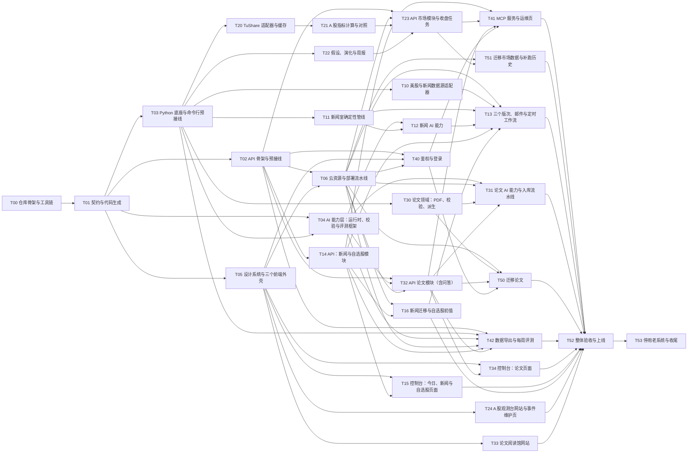

# 任务图说明

`graph.yaml` 是整个重写的工作分解：31 个任务、9 个波次。规则见 `docs/11-Agent协同开发协议.md`。

## 怎么用

1. 编排者运行 `mise run tasks:ready`，得到“依赖都已合并、还没人做”的任务。
2. 每个可开工的任务分给一个工作者：新建 worktree 和分支 `task/<ID>-<短名>`，只读 `read` 里的文档，只改 `owns` 里的路径（外加 `sharedEdits` 写明的范围）。
3. 工作者按 `accept` 自测，把真实输出写进 `docs/progress/<ID>.md`，开 PR `[<ID>] <标题>`。`deferred` 里的项不在本任务验收，统一放到 T52。
4. 编排者按 `docs/11` 第 7 节审查，CI 全绿后 squash 合并；再回到第 1 步。

`difficulty: high` 的任务（契约、API 骨架、AI 运行时、新闻管线与 AI 能力、A 股计算与假设、论文校验与入库、API 论文模块、鉴权、迁移论文）建议交给当时最强的 Agent。

## 波次一览

| 波次 | 可以同时做的任务 |
|---|---|
| 0 | T00 仓库骨架与工具链 |
| 1 | T01 契约与代码生成 |
| 2 | T02 API 骨架与预接线；T03 Python 底座与命令行预接线；T05 设计系统与三个前端外壳 |
| 3 | T04 AI 能力层：运行时、校验与评测框架；T06 云资源与部署流水线；T10 美股与新闻数据源适配器；T11 新闻室确定性管线；T14 API：新闻与自选股模块；T20 TuShare 适配器与缓存；T22 假设、演化与周报；T24 A 股观测台网站与事件维护页；T30 论文领域：PDF、校验、派生；T33 论文阅读馆网站 |
| 4 | T12 新闻 AI 能力；T15 控制台：今日、新闻与自选股页面；T16 新闻迁移与自选股初值；T21 A 股指标计算与对照；T32 API 论文模块（含问答）；T40 鉴权与登录 |
| 5 | T13 三个版次、邮件与定时工作流；T23 API 市场模块与收盘任务；T31 论文 AI 能力与入库流水线；T34 控制台：论文页面；T42 数据导出与每周评测；T50 迁移论文 |
| 6 | T41 MCP 服务与运维页；T51 迁移市场数据与补跑历史 |
| 7 | T52 整体验收与上线 |
| 8 | T53 停用老系统与收尾 |

最宽的是第 3 波：10 个任务可以同时开工。

## 依赖图

（T52 实际依赖全部任务，图里只画了最后汇入的几条。）

## 关卡

| 关卡 | 在哪个任务之后 | Kevin 做什么 |
|---|---|---|
| G0 开工准备 | 开工前 | `docs/07` 第 2 节 |
| G1 看样子 | T05、T06 | 打开三个预览地址看风格 |
| G2 产品验收 | T52 前半 | 按验收清单看预览、收测试邮件、注册通行密钥、在 Claude 里连 MCP |
| G3 上线 | T52 | 在对话里确认两个公开网址切到新系统 |
| G4 停老系统 | T53（上线连续 14 天正常后） | 按 `docs/06` 第 5 节停掉老任务 |
